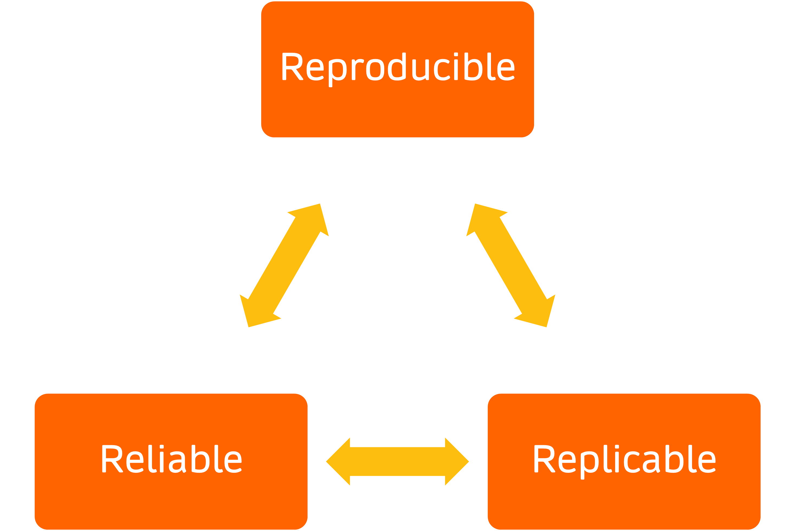
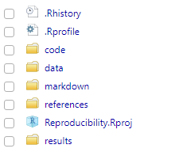
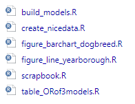
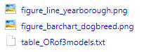
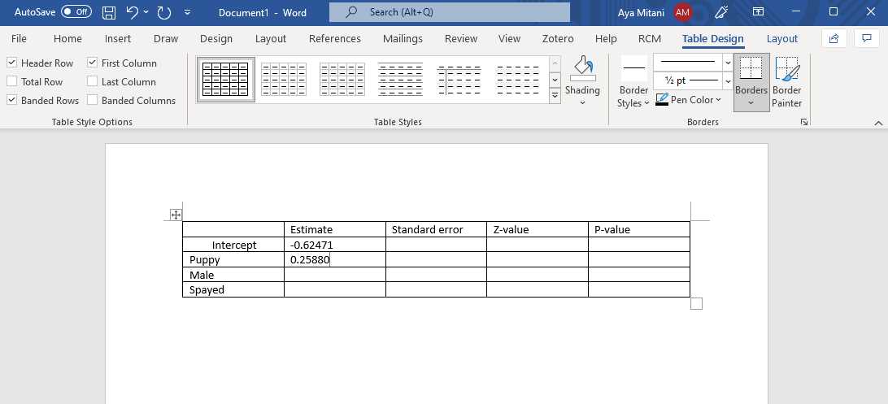
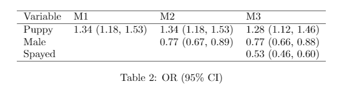

```{r setup, include=FALSE}
options(htmltools.dir.version = FALSE)
knitr::opts_chunk$set(
  #fig.width=9, fig.height=3.5, fig.retina=3,
  fig.retina = 3,
  #out.height = "100%",
  cache = FALSE,
  echo = TRUE,
  message = FALSE, 
  warning = FALSE,
  hiline = TRUE
)
library(here)
library(emo)
library(tidyverse)
library(knitr)
library(xtable)
library(texreg)
library(sjPlot)
```

```{r xaringan-themer, include=FALSE, warning=FALSE}
library(xaringanthemer)
style_duo_accent(
  primary_color = "#002A5C",
  text_bold_color = "#008BB0",
  secondary_color = "#008BB0",
  inverse_header_color = "#FFFFFF"
)
```


## Some definitions

### Science

> knowledge about the structure and behaviour of the natural and physical world, based on **facts** that you can prove, for example by experiments (Oxford Learner's Dictionary)

### Research

> a careful study of a subject, especially in order to discover new **facts** or information about it (Oxford Learner's Dictionary)


---

## Some definitions

### Science

> knowledge about the structure and behaviour of the natural and physical world, based on **facts** that you can prove, for example by experiments (Oxford Learner's Dictionary)

### Research

> a careful study of a subject, especially in order to discover new **facts** or information about it (Oxford Learner's Dictionary)

#### AND to **rediscover** new ~~**facts** or information~~ **claims** about it 


---

## Some definitions

### Science

> knowledge about the structure and behaviour of the natural and physical world, based on **facts** that you can prove, for example by experiments (Oxford Learner's Dictionary)

### Research

> a careful study of a subject, especially in order to discover new **facts** or information about it (Oxford Learner's Dictionary)

#### AND to **rediscover** new ~~**facts** or information~~ **claims** about it, BUT research is rarely reproduced
>  "in the field of cancer research, only about 20–25% or 11% of published studies could be validated or reproduced, and that only about 36% were reproduced in the field of psychology" (Miyakawa, 2020)

.footnote[Tsuyoshi Miyakawa. No raw data, no science: another possible source of the reproducibility crisis. Molecular Brain, 13(24), 2020]


---


## Reproducibility crisis in research

.pull-left[

### Factors contributing to crisis


* Absence of replication

* Lack of transparency

* Data is not generalizable

* Poor quality of analysis
> "while our ability to generate data has grown dramatically, our ability to understand them has not developed at the same rate" (Peng, 2015)

]

.pull-right[
```{r, echo = FALSE, out.height = 400}
articles <- read.csv(here("data", "reprodarticles.csv"), header = TRUE)
articles %>%
  group_by(year) %>%
  count() %>%
  ggplot(aes(year, n)) +
  geom_point(color='#42AB0B', size=2) +
  geom_line(color='#42AB0B', size=2) +
  theme_classic(base_size = 12) +
  labs(title = "Pubmed articles with search term \n('replic' OR 'reproduc') AND 'crisis', 2010-2021", hjust = 0.5,
       y = "Number of articles", x = "Year of publication")
```
]

.footnote[Roger Peng. The reproducibility crisis in science: A statistical counterattack. Significance, 12(3):30-32, 2015]


---


## Reproducibility crisis in research

.pull-left[

### More factors contributing to crisis

* Publication bias

* Pressure to publish

* Lack of training

]

.pull-right[
```{r, echo = FALSE, out.height = 300, fig.cap = "Fig 2. Percent of participants who perceived each of seven barriers to using reproducible research practices (Harris, 2018)"}
knitr::include_graphics("images/surveyresults.png", )
```
]


.footnote[Jenine K. Harris et al. Use of reproducible research practices in public health: A survey of public health analysts. PLOS ONE, 13(9):e0202447, 2018]


---

## Reproducibile or replicable?

- Can someone else completely **reproduce** the results, given the data and code?

- Can someone else **replicate** the analysis using different data?


---

## The three Rs in research

.pull-left[

```{r, echo = FALSE, out.width=600}

```
]


.pull-right[

>"While **replication** is the gold standard for confirming evidence, **reproducibility** requires fewer resources and increases **reliability**" (Harris, 2018)

> "Reproducible research can still be wrong" (Leek & Peng, 2015)

]

.footnote[Jeffrey T. Leek, Roger D. Peng. Reproducible research can still be wrong. PNAS, 112(6):1645-1646, 2015]


---

## Why make research reproducible

>It's good to repeat and review what is good twice and thrice over. [Plato]

.pull-left[
- For **yourself**

  + Build on your own work effectively and efficiently
  
  + Higher research impact
  
  + Produce more reliable research
]
.pull-right[
- For **science**

  + Standard to judge scientific claims
  
  + Encourage replication
  
  + Avoid effort duplication
  
  + Encourage cumulative knowledge development
]


---


## How is research presented?

How is research **presented**?

- Slideshows 

- Journal articles

- Books

- Websites

These are ways to **advertise** your research!

.footnote[[Reproducible Research with R and RStudio](https://radhakrishna.typepad.com/reproducible-research-with-r-and-rstudio---second-edition.pdf) by Christopher Gandrud]


---

## Bridging the gap between research and advertisement

- Your **research** is the 
> "full software environment, code, and data that produced the results" (Donoho, 2010)

- **Research** and **advertisement** should be combined 

```{r, echo = FALSE, fig.align='center', out.width= 800}

```


- ~~"Data and code can be requested from the first author."~~


.footnote[David L Donoho. An invitation to reproducible computational research. Biostatistics, 11(3):385–388, 2010.]


---


## In this presentation

#### I will cover some basic tips to make your research more **reproducible** in `R` and `RStudio`

- Set up your **project**

- **Read in** data 

- Automate **tables**

- Use **functions** and **loops**

- Develop a **package**

- **Future proofing** your project


---

## Example data

### NYC Reported Dog Bites `r emo::ji("dog")`

```{r, echo = FALSE, out.width = 800}
rawbite <- read.csv(here("data", "raw data", "DOHMH_Dog_Bite_Data.csv"), header = TRUE, na.strings=c(""))
rawbite[1:12,c(-1,-3)]
```


---

## Project from RStudio

#### Create your [project](https://support.rstudio.com/hc/en-us/articles/200526207-Using-RStudio-Projects) in [RStudio](https://www.rstudio.com/)

.pull-left[
- File > New Project > ...

- Create sub-folders to **organize** your project

- Separate folders for

  + code
  
  + data
  
  + results
  
  + presentation files
  
  + other documents
]

.pull-right[
```{r, echo = FALSE, out.width = 400}

```
]


---

## Data gathering

### Read in external data

Are you still doing this?

```{r, eval = FALSE}
setwd("C:\\Users\\ayami\\Documents\\Talks\\Reproducibility\\data\\raw data")
repdata <- read.csv("DOHMH_Dog_Bite_Data.csv", header = TRUE)
```

NOT REPRODUCIBLE!!!!!

- Doesn't work on a different machine

- `C:`, `D:`, or `P:`?

- `/`, `\`, or `\\` ?

- Can't output object to a different folder


---

## Data gathering

### `here` package to the rescue!

```{r, eval = FALSE}
library(here)
```

Directory is set to project root folder

```{r}
here()
```

Read in data from a sub-folder

```{r, eval = FALSE}
biteraw <- read.csv(here("data", "raw data", "DOHMH_Dog_Bite_Data.csv"), header = TRUE)
```

Output results to a different sub-folder
```{r, eval = FALSE}
write.csv(bite, here("data", "dogbite.csv"), row.names = FALSE)
```


---

## Data gathering

### My `create_nicedata.R` script

```{r, eval = FALSE}
#-----------------------------------------------------------------
# Author: Aya Mitani
# Last updated: 2021-11-24
# What: Read in raw dog bite data, 
#         remove incidences with missing data, 
#         clean breed and age variables, 
#         write new clean data
#----------------------------------------------------------------

biteraw <- read.csv(here("data", "raw data", "DOHMH_Dog_Bite_Data.csv"), header = TRUE, na.strings=c(""))

# create new variables, exclude missing observations, select relevant variables, etc.

write.csv(bite, here("data", "dogbite.csv"), row.names = FALSE) # output new data 
```


---

## Data gathering

### My analytical data

```{r}
# read in data
bite <- read.csv(here("data", "dogbite.csv"), header = TRUE)
bite[67:75,]
```


---

## Data analysis

```{r}
bite <- read.csv(here("data", "dogbite.csv"), header = TRUE)
```

#### I like to create separate files for each **step** of analysis

.pull-left[
Inside `code` folder
```{r, echo = FALSE, out.height = 200, out.width = 300, fig.align='center'}

```
]

.pull-right[
Inside `results` folder
```{r, echo = FALSE, out.height = 100, out.width = 380, fig.align='center'}

```
]

If a task relies on code from a different script,
```{r, eval = FALSE}
source(here("code", "another_script.R"))
```


---

## Data analysis

### Document, document, document...

.pull-left[
```{r plot-label, eval=FALSE}
bite %>%
  # frequency of bite by breed
  group_by(Breedclean) %>%
  summarise(n=n()) %>%
  ggplot(aes(x = reorder(Breedclean, n), y = n)) + 
  # bar chart
  geom_bar(stat = "identity", aes(fill = Breedclean)) + 
  theme_classic(base_size = 12) + 
  # remove legend
  theme(legend.position = "none") + 
  # name axes
  labs(y = "Count", x = "Breed") + 
  # flip the coordinates
  coord_flip()
```
]

.pull-right[
```{r plot-label-out, ref.label="plot-label", echo=FALSE, fig.height = 5, fig.cap = "Which breed had the most number of reportings?"}
```
]


---

## Data analysis

### Document, document, document...

.pull-left[
```{r plot-label2, eval=FALSE}
bite %>%
  # frequency of bite by borough and year
  group_by(Borough, Year) %>%
  summarise(n = n()) %>%
  # line graph
  ggplot(aes(x = Year, y = n, color = Borough)) + 
  geom_point() + 
  geom_line() + 
  labs(y = "Count", x = "Year") + 
  # specify x-axis ticks and labels
  scale_x_continuous(breaks = seq(2015, 2017, by = 1)) + 
  theme_classic(base_size = 12)
```
]

.pull-right[
```{r plot-label2-out, ref.label="plot-label2", echo=FALSE, fig.height = 5, fig.cap = "Trend in dog bite reporting by NYC boroughs"}
```
]


---

## Data analysis 

#### Research question

> Are bites from pit bulls more likely to be by puppies, males, or spayed dogs?

```{r}
bite2 <- bite %>%
  # create new dummy variables
  mutate(Puppy = ifelse(Age < 4, 1, 0),
         Male = ifelse(Gender == "M", 1, 0),
         Spayed = ifelse(SpayNeuter == "true", 1, 0),
         Pitbull = ifelse(Breedclean == "Pit bull", 1, 0))

# logistic regression
glmbite <- glm(Pitbull ~ Puppy + Male + Spayed, data = bite2, family = binomial("logit"))
summary(glmbite)$coef
```

---

## Are you still doing this?

Copy & paste into Word `r emo::ji("munch")`

```{r, echo = FALSE, out.width=800, fig.align='center'}

```

NOT REPRODUCIBLE!!!!!


---

## `knitr` and `xtable` packages to the rescue!

You wan to 

- **minimize** (or eliminate) human error

- use time **efficiently**

- **automate** table creation with updated/new results

```{r, eval = FALSE}
library(knitr)
```
- `kable()` can create pretty tables from dataframes and matrices

- quick and simple but limited customization ability

```{r, eval = FALSE}
library(xtable)
```

- `xtable()` converts many R objects into LaTex table code

- Flexible with more customization ability 


---

## `knitr` package

### Basic `kable()` options

```{r}
sumbite <- summary(glmbite)
class(sumbite$coefficients)
kable(sumbite$coefficients, format = 'html')
```


---

## `knitr` package

### More `kable()` options
```{r}
kable(sumbite$coefficients, 
      format = 'html',
      digits = 3,      # specify number of decimal places to show
      col.names = c("Est", "SE", "Z-value", "P-value"), # edit the column names
      align = "c",     # options for alignment are 'l' (left), 'c' (center), 'r' (right) which is the default
      caption = "Results from logistic regression analysis") # title of the table
```


---

## `knitr` package

.pull-left[
### `kable()` with LaTex format 
```{r kable, eval=FALSE}
kable(sumbite$coefficients, 
      # use latex format
      format = 'latex',
      # specify number of decimal places to show
      digits = 3,  
      # edit the column names
      col.names = c("Est", "SE", "Z-value", "P-value"), 
      # options for alignment are 'l' (left), 'c' (center), 'r' (right) which is the default
      align = "c",     
      # title of the table
      caption = "Results from logistic regression analysis") 
```
]

.pull-right[
```{r kable-out, ref.label="kable", echo=FALSE, fig.height = 5}
```
]


---


## `xtable` package


.left-column[
#### Basic `xtable()` with `lm` or `glm` class objects
```{r}
class(glmbite) 
```
]

.right-column[
```{r}
xtable(glmbite) 
```
]


---

## `xtable` package

.pull-left[
#### Some `xtable()` customizations
```{r xtable1, eval=FALSE}
table1 <- 
xtable(glmbite,
       # title of the table
       caption = "Results from logistic regression analysis",
       # label for referencing 
       label = "table:logreg",
       # number of decimal places
       digits = 2
       ) 
print.xtable(table1)
```

- Include in Rmarkdown file with PDF output

- Copy & paste into LaTex editor, [Overleaf](https://www.overleaf.com)
]


.pull-right[
```{r xtable1-out, ref.label="xtable1", echo=FALSE, fig.height = 5}
```
]


---

## `xtable` package

### `print.xtable()` has even more options

#### Save LaTex code as text file
```{r, eval = FALSE}
print.xtable(table1, file = here("results", "table1.txt"))
```

---

## `xtable` package

### `print.xtable()` has even more options

#### Create HTML table
```{r}
print.xtable(table1, type = "html", caption.placement = "top")
```

---

## `xtable` package

### `print.xtable()` has even more options

#### Create HTML table

<!-- html table generated in R 4.1.1 by xtable 1.8-4 package -->
<!-- Thu Nov 25 19:44:07 2021 -->
<table border=1>
<caption align="top"> Results from logistic regression analysis </caption>
<tr> <th>  </th> <th> Estimate </th> <th> Std. Error </th> <th> z value </th> <th> Pr(&gt;|z|) </th>  </tr>
  <tr> <td align="right"> (Intercept) </td> <td align="right"> -0.63 </td> <td align="right"> 0.08 </td> <td align="right"> -7.93 </td> <td align="right"> 0.00 </td> </tr>
  <tr> <td align="right"> Puppy </td> <td align="right"> 0.25 </td> <td align="right"> 0.07 </td> <td align="right"> 3.66 </td> <td align="right"> 0.00 </td> </tr>
  <tr> <td align="right"> Male </td> <td align="right"> -0.27 </td> <td align="right"> 0.07 </td> <td align="right"> -3.70 </td> <td align="right"> 0.00 </td> </tr>
  <tr> <td align="right"> Spayed </td> <td align="right"> -0.63 </td> <td align="right"> 0.07 </td> <td align="right"> -9.46 </td> <td align="right"> 0.00 </td> </tr>
   </table>

---

## [`texreg`](https://www.jstatsoft.org/article/view/v055i08) package for multiple models

#### I want to compare results from these three models
```{r}
# m1: x = Puppy
m1 <- glm(Pitbull ~ Puppy, data = bite2, family = binomial("logit"))
# m2: x = Puppy & Male
m2 <- glm(Pitbull ~ Puppy + Male, data = bite2, family = binomial("logit"))
# m3: x = Puppy & Male & Spayed
m3 <- glm(Pitbull ~ Puppy + Male + Spayed, data = bite2, family = binomial("logit"))
```

---

## [`texreg`](https://www.jstatsoft.org/article/view/v055i08) package for multiple models

.left-column[
#### `screenreg()` for text output to the R console

```{r, eval = FALSE}
screenreg(list(m1, m2, m3))
```
]
.right-column[
```{r, echo = FALSE}
screenreg(list(m1, m2, m3))
```
]


---

## [`texreg`](https://www.jstatsoft.org/article/view/v055i08) package for multiple models

.left-column[
#### Display 95% confidence intervals 

```{r, eval = FALSE}
screenreg(list(m1, m2, m3), 
          ci.force = TRUE)
```
]
.right-column[
```{r, echo = FALSE}
screenreg(list(m1, m2, m3), ci.force = TRUE)
```
]


---

## [`texreg`](https://www.jstatsoft.org/article/view/v055i08) package for multiple models

.left-column[
#### `texreg()` for LaTex output

```{r, eval = FALSE}
texreg(list(m1, m2, m3), 
       caption = "Dog bite models")
```
]
.right-column[
```{r, echo = FALSE}
texreg(list(m1, m2, m3), caption = "Dog bite models")
```
]

---

## [`texreg`](https://www.jstatsoft.org/article/view/v055i08) package for multiple models

#### `htmlreg()` for HTML output

```{r}
htmlreg(list(m1, m2, m3), caption = "Dog bite models")
```

---

.left-column[
### HTML table from `htmlreg()` 
]

.right-column[
<table class="texreg" style="margin: 10px auto;border-collapse: collapse;border-spacing: 0px;caption-side: bottom;color: #000000;border-top: 2px solid #000000;">
<caption>Dog bite models</caption>
<thead>
<tr>
<th style="padding-left: 5px;padding-right: 5px;">&nbsp;</th>
<th style="padding-left: 5px;padding-right: 5px;">Model 1</th>
<th style="padding-left: 5px;padding-right: 5px;">Model 2</th>
<th style="padding-left: 5px;padding-right: 5px;">Model 3</th>
</tr>
</thead>
<tbody>
<tr style="border-top: 1px solid #000000;">
<td style="padding-left: 5px;padding-right: 5px;">(Intercept)</td>
<td style="padding-left: 5px;padding-right: 5px;">-1.15<sup>***</sup></td>
<td style="padding-left: 5px;padding-right: 5px;">-0.97<sup>***</sup></td>
<td style="padding-left: 5px;padding-right: 5px;">-0.63<sup>***</sup></td>
</tr>
<tr>
<td style="padding-left: 5px;padding-right: 5px;">&nbsp;</td>
<td style="padding-left: 5px;padding-right: 5px;">(0.05)</td>
<td style="padding-left: 5px;padding-right: 5px;">(0.07)</td>
<td style="padding-left: 5px;padding-right: 5px;">(0.08)</td>
</tr>
<tr>
<td style="padding-left: 5px;padding-right: 5px;">Puppy</td>
<td style="padding-left: 5px;padding-right: 5px;">0.29<sup>***</sup></td>
<td style="padding-left: 5px;padding-right: 5px;">0.29<sup>***</sup></td>
<td style="padding-left: 5px;padding-right: 5px;">0.25<sup>***</sup></td>
</tr>
<tr>
<td style="padding-left: 5px;padding-right: 5px;">&nbsp;</td>
<td style="padding-left: 5px;padding-right: 5px;">(0.07)</td>
<td style="padding-left: 5px;padding-right: 5px;">(0.07)</td>
<td style="padding-left: 5px;padding-right: 5px;">(0.07)</td>
</tr>
<tr>
<td style="padding-left: 5px;padding-right: 5px;">Male</td>
<td style="padding-left: 5px;padding-right: 5px;">&nbsp;</td>
<td style="padding-left: 5px;padding-right: 5px;">-0.26<sup>***</sup></td>
<td style="padding-left: 5px;padding-right: 5px;">-0.27<sup>***</sup></td>
</tr>
<tr>
<td style="padding-left: 5px;padding-right: 5px;">&nbsp;</td>
<td style="padding-left: 5px;padding-right: 5px;">&nbsp;</td>
<td style="padding-left: 5px;padding-right: 5px;">(0.07)</td>
<td style="padding-left: 5px;padding-right: 5px;">(0.07)</td>
</tr>
<tr>
<td style="padding-left: 5px;padding-right: 5px;">Spayed</td>
<td style="padding-left: 5px;padding-right: 5px;">&nbsp;</td>
<td style="padding-left: 5px;padding-right: 5px;">&nbsp;</td>
<td style="padding-left: 5px;padding-right: 5px;">-0.63<sup>***</sup></td>
</tr>
<tr>
<td style="padding-left: 5px;padding-right: 5px;">&nbsp;</td>
<td style="padding-left: 5px;padding-right: 5px;">&nbsp;</td>
<td style="padding-left: 5px;padding-right: 5px;">&nbsp;</td>
<td style="padding-left: 5px;padding-right: 5px;">(0.07)</td>
</tr>
<tr style="border-top: 1px solid #000000;">
<td style="padding-left: 5px;padding-right: 5px;">AIC</td>
<td style="padding-left: 5px;padding-right: 5px;">5449.95</td>
<td style="padding-left: 5px;padding-right: 5px;">5439.24</td>
<td style="padding-left: 5px;padding-right: 5px;">5350.44</td>
</tr>
<tr>
<td style="padding-left: 5px;padding-right: 5px;">BIC</td>
<td style="padding-left: 5px;padding-right: 5px;">5462.85</td>
<td style="padding-left: 5px;padding-right: 5px;">5458.59</td>
<td style="padding-left: 5px;padding-right: 5px;">5376.24</td>
</tr>
<tr>
<td style="padding-left: 5px;padding-right: 5px;">Log Likelihood</td>
<td style="padding-left: 5px;padding-right: 5px;">-2722.97</td>
<td style="padding-left: 5px;padding-right: 5px;">-2716.62</td>
<td style="padding-left: 5px;padding-right: 5px;">-2671.22</td>
</tr>
<tr>
<td style="padding-left: 5px;padding-right: 5px;">Deviance</td>
<td style="padding-left: 5px;padding-right: 5px;">5445.95</td>
<td style="padding-left: 5px;padding-right: 5px;">5433.24</td>
<td style="padding-left: 5px;padding-right: 5px;">5342.44</td>
</tr>
<tr style="border-bottom: 2px solid #000000;">
<td style="padding-left: 5px;padding-right: 5px;">Num. obs.</td>
<td style="padding-left: 5px;padding-right: 5px;">4673</td>
<td style="padding-left: 5px;padding-right: 5px;">4673</td>
<td style="padding-left: 5px;padding-right: 5px;">4673</td>
</tr>
</tbody>
<tfoot>
<tr>
<td style="font-size: 0.8em;" colspan="4"><sup>***</sup>p &lt; 0.001; <sup>**</sup>p &lt; 0.01; <sup>*</sup>p &lt; 0.05</td>
</tr>
</tfoot>
</table>
]


---

## Writing R functions

#### I want to show **Odds Ratio (95% CI)** for the table

In logistic regression,

$$
\text{OR} = \exp(\hat{\beta})
$$

```{r, eval = FALSE}
OR <- exp(beta)
```


$$
95\% \text{ CI} =  \text{exp} \left[ \hat{\beta} \pm 1.96 \times \text{SE}(\hat{\beta})  \right]
$$
```{r, eval = FALSE}
ORlcl <- exp(beta - 1.96 * se_beta)
ORucl <- exp(beta + 1.96 * se_beta)
```


---

## Are you still doing this?

```{r}
# OR for m1
OR_m1 <- exp(summary(m1)$coefficients[,1])
ORlcl_m1 <- exp(summary(m1)$coefficients[,1] - 1.96 * summary(m1)$coefficients[,2])
ORucl_m1 <- exp(summary(m1)$coefficients[,1] + 1.96 * summary(m1)$coefficients[,2])

# OR for m2
OR_m2 <- exp(summary(m2)$coefficients[,1])
ORlcl_m2 <- exp(summary(m2)$coefficients[,1] - 1.96 * summary(m2)$coefficients[,2])
ORucl_m2 <- exp(summary(m2)$coefficients[,1] + 1.96 * summary(m2)$coefficients[,2])

# OR for m3
OR_m3 <- exp(summary(m3)$coefficients[,1])
ORlcl_m3 <- exp(summary(m3)$coefficients[,1] - 1.96 * summary(m3)$coefficients[,2])
ORucl_m3 <- exp(summary(m3)$coefficients[,1] + 1.96 * summary(m3)$coefficients[,2])

```

NOT REPRODUCIBLE!!!

---

## Writing R functions

#### A function to create OR (95%) with options for $\alpha$ level and number of decimal places

```{r}
# coef is the vector of estimates
# se is the vector of standard errors
# siglevel is the significance (alpha) level
# roundto is the number of decimal places
OR_95CI <- function(coef, se, siglevel, roundto){
  q <- 1 - siglevel / 2
  OR <- exp(coef)
  ORlcl <- exp(coef - qnorm(q) * se)
  ORucl <- exp(coef + qnorm(q) * se)
  ORresult <- paste0(format(round(OR, roundto), nsmall=roundto), " (", format(round(ORlcl, roundto), nsmall=roundto), ", ", format(round(ORucl, roundto), nsmall=roundto), ")")
  return(ORresult)
}
orout1 <- OR_95CI(summary(m1)$coef[,1], summary(m1)$coef[,2], 0.05, 2)
orout1
```

---

## Using loops in R

#### Lists are **very** useful in R

```{r}
m <- list()
m[[1]] <- glm(Pitbull ~ Puppy, data = bite2, family = binomial("logit"))
m[[2]] <- glm(Pitbull ~ Puppy + Male, data = bite2, family = binomial("logit"))
m[[3]] <- glm(Pitbull ~ Puppy + Male + Spayed, data = bite2, family = binomial("logit"))
msum <- lapply(m, summary)
msum[[1]]$coef
msum[[1]]$coef[,1]
```

---

## Using loops in R

#### Lists are **very** useful in R
```{r}
orvec <- list()
for(i in 1:3) orvec[[i]] <- OR_95CI(msum[[i]]$coef[,1], msum[[i]]$coef[,2], 0.05, 2)
orvec
```


---

## Back to `xtable`

```{r}
varnames <- c("Intercept", "Puppy", "Male", "Spayed") # create vector of variable names
ORout <- data.frame(varnames, c(orvec[[1]], rep(NA, 2)), c(orvec[[2]], NA), orvec[[3]]) # create data frame of ORs
names(ORout) <- c("Variable", "M1", "M2", "M3") # give column names
ORtable <- xtable(ORout[-1,], caption = "OR (95% CI)") # create xtable object but remove Intercept
print(ORtable, include.rownames = FALSE) # print xtable but remove row numbers
```


---

## Output of `xtable`

```{r, echo = FALSE, out.width = 800, fig.align='center'}

```


---

## R function to R package

#### I want to keep using `OR_95CI()` function for my other projects!

```{r}
OR_95CI <- function(coef, se, siglevel, roundto){
  q <- 1 - siglevel / 2
  OR <- exp(coef)
  ORlcl <- exp(coef - qnorm(q) * se)
  ORucl <- exp(coef + qnorm(q) * se)
  ORresult <- paste0(format(round(OR, roundto), nsmall=roundto), " (", format(round(ORlcl, roundto), nsmall=roundto), ", ", format(round(ORucl, roundto), nsmall=roundto), ")")
  return(ORresult)
}
```

- Save the R script on my computer and copy & paste it for every project $\rightarrow$ NOT REPRODUCIBLE!!!

- I have some other related R functions that I often use

- Turn them into a **R package** and save it on my **GitHub** account

---

## Creating R packages

#### Use `devtools` package

```{r, eval = FALSE}
library(devtools)
```
**Major steps** (More details [here](https://rpubs.com/ayamitani/rpackage))
1. Open R Studio
    + New Project > New Directory > R Package > Enter info > Create Project
2. Edit your package
    + Each function should be saved in its own file
    + Write the package description and document functions
    + Include some data
    + Write a vignette
3. Create a new repository in GitHub
    + Repo name = package name
4. Connect to GitHub
5. Pull + Commit + Push
6. Use/share package with `install_github()`


---

## Using my R package

#### Install and load package from [GitHub](https://github.com/ayamitani/oddsratio)

```{r, eval = FALSE}
library(devtools) # load devtools package
devtools::install_github("ayamitani/oddsratio") # install package from git repo
library(oddsratio) # load package
```

```{r}
# new logistic regression model
m4 <- glm(Pitbull ~ Agenum, data = bite2, family = binomial("logit"))
# save table of coefficients and standard errors from summary output
m4coef <- summary(m4)$coef
# apply function
OR_95CI(m4coef[,1], m4coef[,2], 0.05, 3)
```


---

## Publishing R package on CRAN

- The [Comprehensive R Archive Network (CRAN)](https://cran.r-project.org/) has ~18,000 R packages 

- Package on CRAN can be downloaded with `install.packages()`

- Publishing your R package on CRAN requires a lot more work than making it available on GitHub

- Going through all the necessary steps, your package will be more **accessible** to a wider audience


---

## Publishing R package on CRAN


- Read the [CRAN Repository Policy](https://cran.r-project.org/web/packages/policies.html) and [Checklist for CRAN submissions](https://cran.r-project.org/web/packages/submission_checklist.html)

- Follow [@CRANPolicyWatch](https://twitter.com/CRANPolicyWatch) on Twitter

- Submit your package using the [submission form](https://cran.r-project.org/submit.html)

- CRAN maintainer will review your package 

  + Review can take up to 5 days (check status [here](https://cran.r-project.org/web/checks/check_summary_by_maintainer.html))
  + You package may get rejected $\rightarrow$ revise, recheck and resubmit
  
- Write an article describing your package

  + Your own website
  + Research paper
  + Software journals ([Journal of Statistical Software](https://www.jstatsoft.org/index), [The R Journal](The R Journalhttps://journal.r-project.org), [Journal of Open Source Software](https://joss.theoj.org/))
  


---

## Future proof your research

- Record your R session information
```{r, eval = FALSE}
sessionInfo()
```

- Set seed for random generation
```{r, eval = FALSE}
set.seed()
```

- Save everything as text files (`.txt`)

- Make your code **human** readable

  + [`formatR`](https://yihui.org/formatr/) package is useful 
```{r, eval = FALSE}
library(formatR)
```

- Document, document, document...


---

## Final thoughts

- I'm still learning

- Normalize making research reproducible

  + **Teach** the tools 

  + **Train** the new generation of researchers
  
  + **Practice** reproducibility

- Contribute more to replicating research

  + Change the institutional culture from bottom up!


---
class: center, middle

## This presentation is reproducible!


### From my GitHub Repo [reprod_slides](https://github.com/ayamitani/reprod_slides)


Slides created via the R packages:

[**xaringan**](https://github.com/yihui/xaringan)<br>
[gadenbuie/xaringanthemer](https://github.com/gadenbuie/xaringanthemer)


